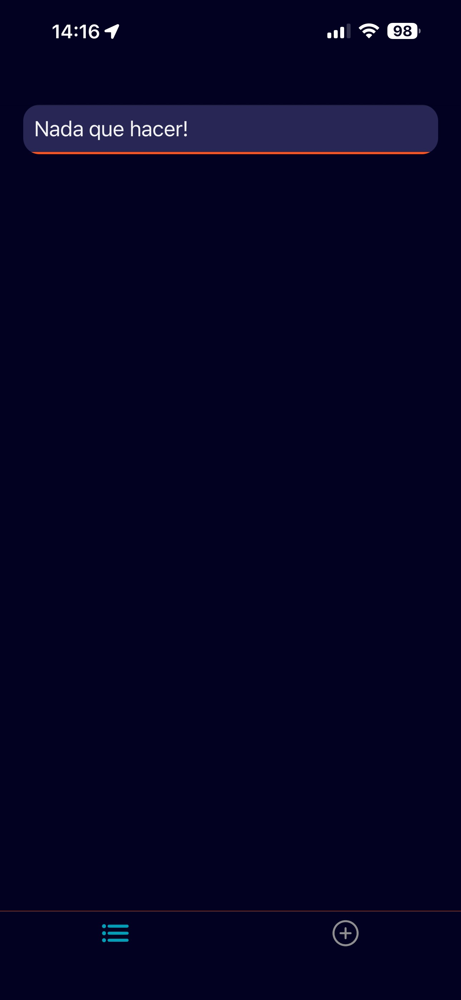
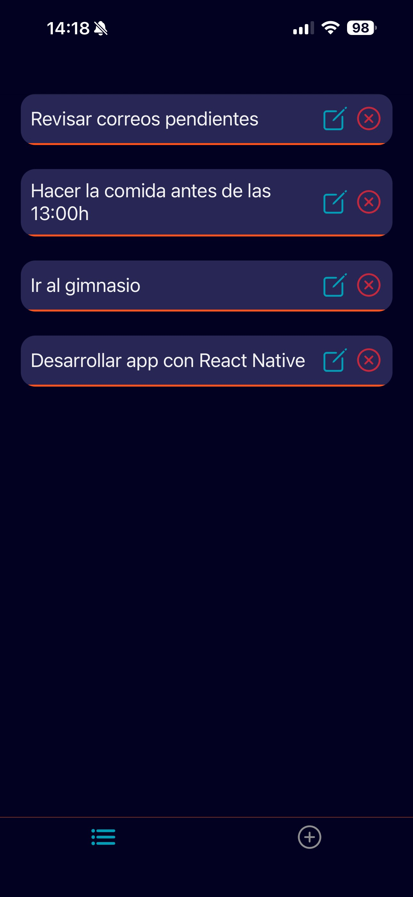
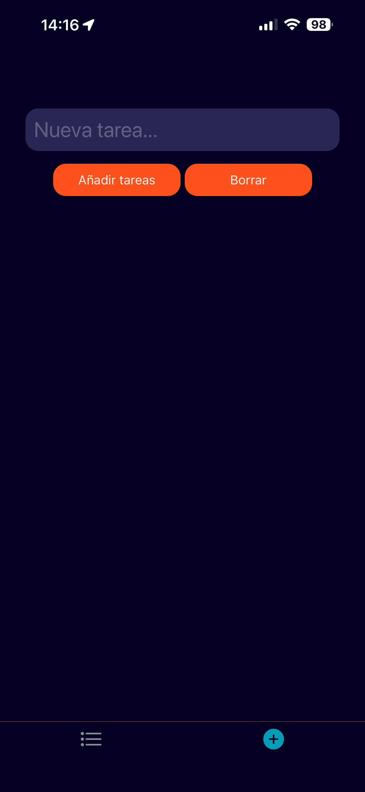

# ToDo List con React Native

## Stack del proyecto


## Imágenes del Proyecto

<div style="display: flex; gap: 10px;">
  
  
  
</div>

## Instalación local

```bash

npm install

npm start

```
